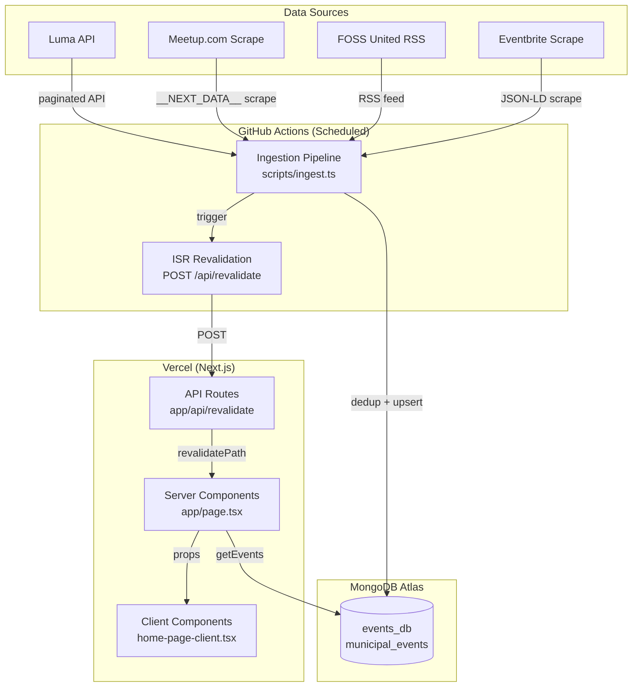
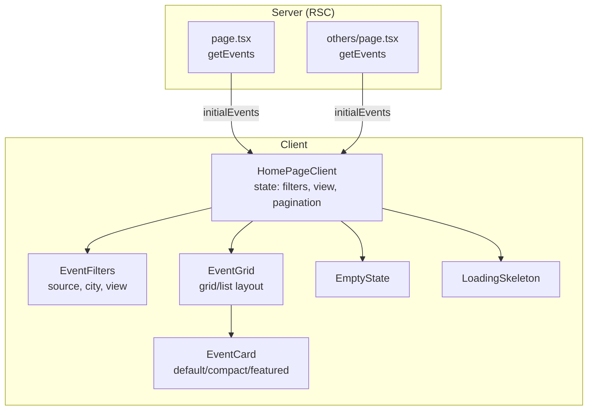
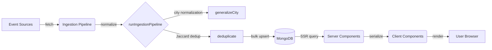
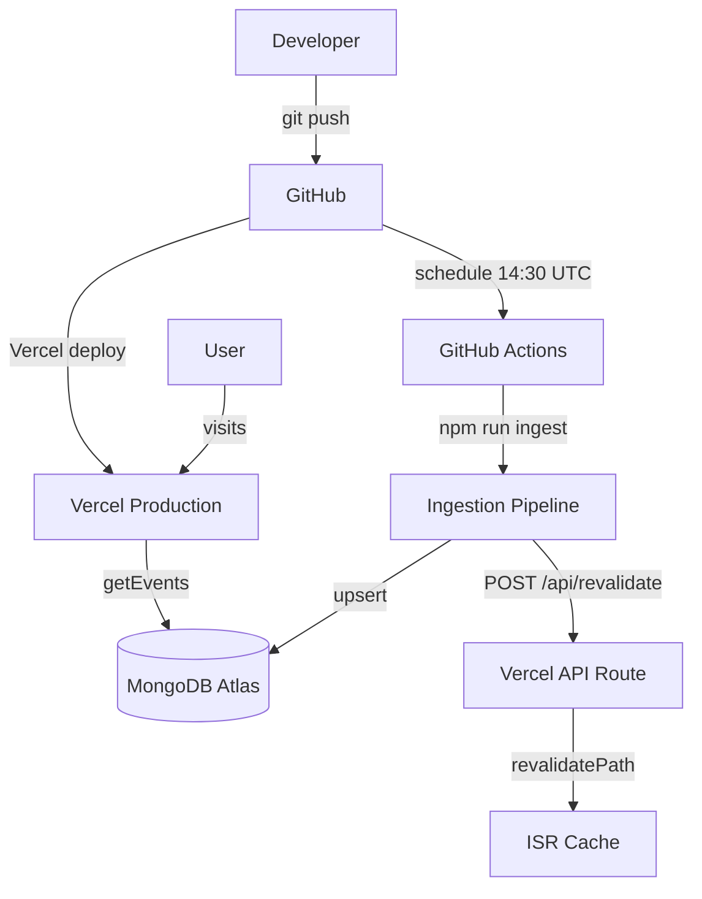

# Architecture — High-Level Design

## System Overview

Weekends Plan is a server-rendered Next.js application that aggregates tech events from multiple platforms (Luma, Meetup, FOSS United, Eventbrite) into a unified, filterable feed. Events are ingested via a scheduled GitHub Actions pipeline, stored in MongoDB Atlas, and served via Next.js App Router with Incremental Static Regeneration (ISR).

## Tech Stack

| Layer         | Technology                   | Purpose                              |
| ------------- | ---------------------------- | ------------------------------------ |
| **Framework** | Next.js 14 (App Router)      | SSR, ISR, API routes                 |
| **Language**  | TypeScript 5.4               | Type safety across stack             |
| **Styling**   | Tailwind CSS 3.4 + shadcn/ui | Utility-first CSS + Radix primitives |
| **Database**  | MongoDB 6.5 (Atlas)          | Event storage                        |
| **CI/CD**     | GitHub Actions               | Daily event ingestion                |
| **Hosting**   | Vercel                       | Production deployment                |
| **Icons**     | lucide-react                 | UI icons                             |
| **Theme**     | next-themes                  | Dark/light mode                      |

## System Architecture Diagram

## Component Architecture

## Data Flow

## Deployment Architecture

## Key Design Decisions

1. **SSR over SSG** — Pages use `force-dynamic` because event data changes daily. ISR revalidation via API route after each ingestion run.
2. **No authentication** — Public read-only app. Ingestion runs via GitHub Actions with environment secrets.
3. **Deterministic IDs** — `makeEventId(source, originalId)` produces SHA-256 hex keys, enabling idempotent upserts.
4. **Split collections** — `municipal_events` for Indian tech events, `other_events` for everything else (currently all events go to the first collection).
