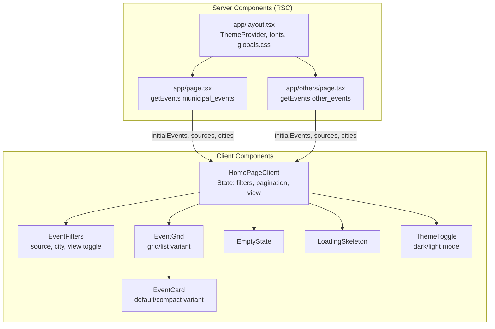
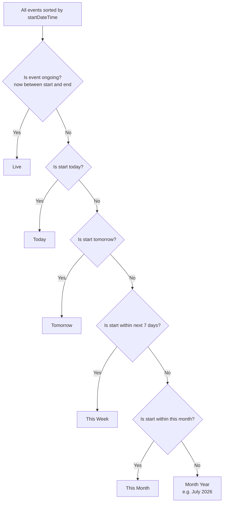
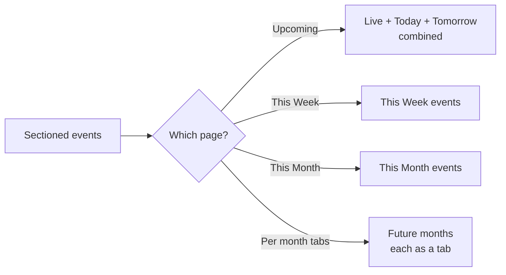

# Frontend Components — Low-Level Design

## Page Structure



### Server Components

| File                  | Route     | Function                                                                             |
| --------------------- | --------- | ------------------------------------------------------------------------------------ |
| `app/page.tsx`        | `/`       | Fetches `municipal_events`, extracts unique sources/cities, renders `HomePageClient` |
| `app/others/page.tsx` | `/others` | Same flow for `other_events` collection                                              |
| `app/layout.tsx`      | all       | Root layout with Inter font, `ThemeProvider` (default dark), globals                 |

Both pages use `export const dynamic = "force-dynamic"` to skip static generation.

## HomePageClient State Management

```typescript
// Core state tracked in HomePageClient (~355 lines)
interface HomePageState {
  selectedSources: string[]; // Multi-select source filter
  selectedCities: string[]; // Multi-select city filter
  viewMode: "grid" | "list"; // Display layout toggle
}
```

### Event Sectioning Logic

Events are grouped into time-based sections:



Implemented via `getSection(date, now, endDate?)` in `lib/date-utils.ts`.

### Pagination

Events are paginated by section:



When switching sections, the view scrolls to the corresponding event section.

## Component Tree

### EventCard Variants

| Variant    | Use                  | Layout                                                                                         |
| ---------- | -------------------- | ---------------------------------------------------------------------------------------------- |
| `default`  | Grid view            | Vertical card with image, badge, title, description (truncated), location, date, action button |
| `compact`  | List view            | Horizontal row with icon, title, date, location, action button                                 |
| `featured` | Defined but not used | Larger hero-style card                                                                         |

### EventFilters Controls

| Control         | Type                   | Behavior                                        |
| --------------- | ---------------------- | ----------------------------------------------- |
| Source dropdown | Single-select dropdown | Filters by source (Luma/Meetup/FOSS/Eventbrite) |
| City dropdown   | Single-select dropdown | Filters by canonical city                       |
| View toggle     | Icon buttons           | Switches grid/list layout                       |
| Clear all       | Button                 | Resets all filters                              |

## UI Primitives (shadcn/ui)

| Component      | Source                        | Customizations                                                                        |
| -------------- | ----------------------------- | ------------------------------------------------------------------------------------- |
| `Badge`        | @radix-ui + CVA               | Source-specific color variants (luma=blue, foss=green, meetup=orange, eventbrite=red) |
| `Button`       | CVA                           | Multiple size/variant combinations                                                    |
| `Card`         | Compound component            | CardHeader, CardTitle, CardDescription, CardContent, CardFooter                       |
| `DropdownMenu` | @radix-ui/react-dropdown-menu | Full implementation with trigger, content, items, separators                          |
| `Input`        | Styled input                  | Standard styling                                                                      |
| `Skeleton`     | Animated div                  | Pulse animation for loading states                                                    |

## Theme

- **Provider:** `next-themes` wrapping the root layout
- **Mode:** `"class"` strategy (Tailwind dark mode via class toggle)
- **Default:** `dark`
- **Toggle:** `ThemeToggle` component with Sun/Moon icons

## Styling Conventions

- Classes combined via `cn()` utility (`clsx` + `tailwind-merge`)
- CSS variables for light/dark color tokens in `app/globals.css`
- Custom `blink` animation defined in `tailwind.config.ts`
- Dates formatted with `en-IN` locale (e.g., "Sat, 27 Jun, 02:30 PM")
