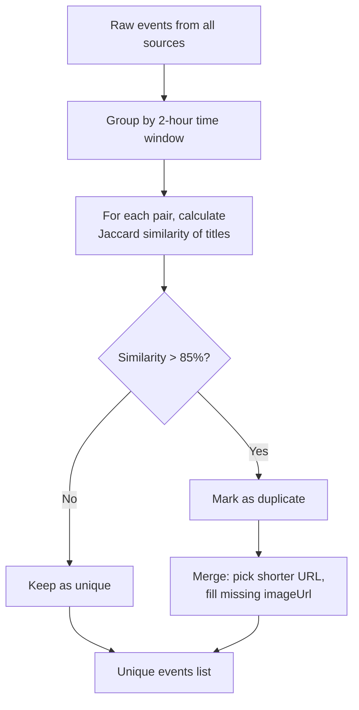
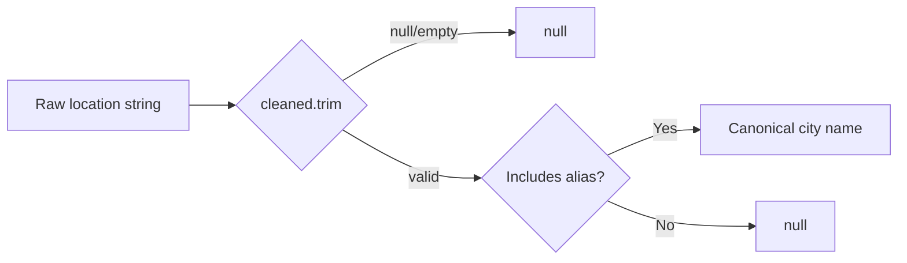

# Data Model — Low-Level Design

## MongoDB Document Schema

**Database:** `events_db`
**Collections:** `municipal_events`, `other_events`

### NormalizedEvent

```typescript
interface NormalizedEvent {
  _id: string; // SHA-256 hex of source + originalId
  title: string; // Event title
  description: string; // Markdown or plain text description
  startDateTime: Date; // Event start (always set)
  endDateTime?: Date; // Optional end time
  location: {
    name: string; // Venue name
    address?: string; // Street address
    coordinates?: {
      lat: number;
      lng: number;
    };
    city?: string; // Canonical city name (post-normalization)
  };
  sourceName: string; // "luma" | "meetup" | "foss" | "eventbrite"
  originalUrl: string; // Link to the event on source platform
  imageUrl?: string; // Banner/thumbnail image
  category: string; // Event category
  tags?: string[]; // Optional tags
  updatedAt: Date; // Last upsert timestamp
}
```

## TypeScript Interfaces

### Source Configuration

```typescript
type IngestType = "API" | "ICS" | "RSS" | "SCRAPE";

interface SourceConfig {
  id: string; // "luma" | "foss" | "meetup" | "eventbrite"
  name: string; // Display name
  type: IngestType; // Ingestion method
  enabled: boolean; // Whether to fetch from this source
}
```

### Ingestion Result

```typescript
interface IngestionResult {
  totalFetched: number; // Raw events from all sources
  totalUnique: number; // After deduplication
  inserted: number; // New documents in municipal_events
  modified: number; // Updated documents in municipal_events
  otherInserted: number; // New documents in other_events
  otherModified: number; // Updated documents in other_events
  sourceResults: Array<{
    source: string; // Source name
    count: number; // Events fetched
    error?: string; // Error message if source failed
  }>;
}
```

### Event Section (Date Grouping)

```typescript
interface EventSection {
  label: string; // "Live" | "Today" | "Tomorrow" | "This Week" | "This Month" | "July 2026"
  key: string; // "live" | "today" | "tomorrow" | "this-week" | "this-month" | "month-2026-6"
}
```

## Ingestion Client Interface

```typescript
interface Ingester {
  readonly id: string;
  fetch(): Promise<NormalizedEvent[]>;
}
```

All source clients implement this interface. The `registry.ts` factory maps source IDs to client classes.

## Deduplication Algorithm



**Algorithm details:**

- Compares every incoming event against the running unique list (O(n²) but acceptable for <1000 events)
- **Time window:** events must start within 2 hours of each other
- **Jaccard similarity:** tokenizes titles by lowercase alphanumeric words, computes intersection over union
- **Merge strategy:** picks the shorter/more specific URL (generic paths like `/` or `/events` lose); fills missing `imageUrl` from duplicate

## City Normalization



**Canonical cities:** Hyderabad, Bengaluru, Mumbai, New Delhi, Pune, Chennai

Each canonical city has 15–23 locality/suburb aliases (e.g., "Gachibowli" → Hyderabad, "Koramangala" → Bengaluru). Uses bidirectional substring matching: checks if cleaned input contains a known alias OR if an alias contains the cleaned input.

## Deterministic Event ID

```
makeEventId(source: string, id: string) => SHA-256 hex

Example: makeEventId("luma", "evt-abc123") => "a1b2c3d4..."
```

This enables idempotent upserts: same source + same original ID always produces same `_id`, so `bulkWrite` with `upsert: true` never creates duplicates.
