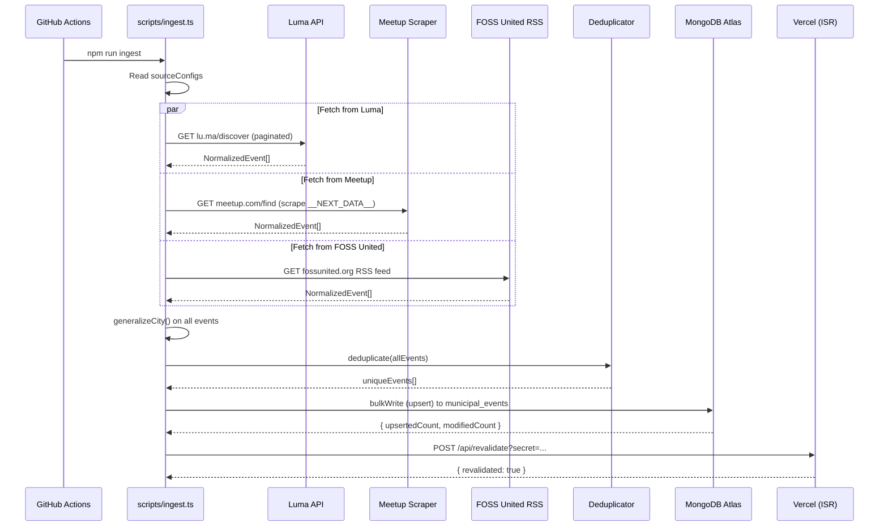

# Ingestion Pipeline

## Overview

The ingestion pipeline runs daily via GitHub Actions (scheduled at 14:30 UTC / 8:00 PM IST) and can also be triggered manually via `workflow_dispatch`. It fetches events from all enabled sources, normalizes city names, deduplicates, and upserts into MongoDB.

## Pipeline Flow



## Component Architecture

```mermaid
graph TB
    subgraph "Entry Point"
        CLI[scripts/ingest.ts]
    end

    subgraph "Ingestion Framework"
        INDEX[services/ingestion/index.ts]
        BASE[services/ingestion/base.ts<br/>Ingester interface]
        REG[services/ingestion/registry.ts<br/>Factory + INGESTERS map]
        ORCH[services/ingestion/orchestrator.ts<br/>runIngestionPipeline]
        LOC[services/ingestion/location-cleaner.ts]
    end

    subgraph "Source Clients"
        LUMA[clients/luma.ts]
        MEETUP[clients/meetup.ts]
        FOSS[clients/foss.ts]
        EVB[clients/eventbrite.ts]
    end

    subgraph "Shared Services"
        DEDUP[services/deduplicator.ts]
        CITY[lib/city-aliases.ts]
    end

    subgraph "Configuration"
        CONFIG[config/sources.ts<br/>SourceConfig[]]
    end

    CONFIG --> ORCH
    CLI --> ORCH
    ORCH --> REG
    REG --> LUMA
    REG --> MEETUP
    REG --> FOSS
    REG --> EVB
    ORCH --> CITY
    ORCH --> DEDUP
    ORCH --> LOC
```

## Source Clients

### Luma (API)

| Property | Value |
|---|---|
| **Type** | API (`IngestType: "API"`) |
| **Method** | Paginated POST to `lu.ma/api/discover` |
| **Page size** | 500 events |
| **Max total** | 1000 events |
| **Discovery** | Predefined SLUGS (city slugs + tech/ai/crypto categories), two-stage: global discover + per-slug discover |
| **Headers** | Custom headers mimicking browser request |
| **Status** | Enabled |

### Meetup (Scrape)

| Property | Value |
|---|---|
| **Type** | Scrape (`IngestType: "API"` — actually scrapes) |
| **Method** | Fetches `meetup.com/find` pages, extracts `__NEXT_DATA__` JSON, parses Apollo GraphQL state |
| **Categories** | tech, career, science, games |
| **Cities** | 4 Indian cities |
| **Timeout** | 15 seconds |
| **Status** | Enabled |

### FOSS United (RSS)

| Property | Value |
|---|---|
| **Type** | RSS (`IngestType: "RSS"`) |
| **Method** | Parses `fossunited.org/events/timeline/rss.xml` via `feedparser` |
| **Date parsing** | Custom Indian date format parser (`IST_OFFSET` applied) |
| **Description** | Extracts city/link from HTML content in RSS item |
| **Status** | Enabled |

### Eventbrite (Scrape)

| Property | Value |
|---|---|
| **Type** | Scrape (`IngestType: "API"`) |
| **Method** | Fetches eventbrite.com category pages, parses JSON-LD structured data |
| **Cities** | 10 Indian city slugs |
| **Categories** | science--tech, tech, business |
| **Timeout** | 15 seconds |
| **Status** | **Disabled** in config |

## ISR Revalidation

After upserting to MongoDB, the ingestion script calls back to the production app:

```
POST /api/revalidate?secret=<REVALIDATION_SECRET>
```

This triggers `revalidatePath("/")` to flush the ISR cache, ensuring the next visitor sees fresh event data. The secret is stored as a GitHub Actions secret and verified server-side.

## Error Handling

- Each source is fetched in parallel via `Promise.allSettled`
- Individual source failures are logged and recorded in `sourceResults[]` with the error message
- A failed source does not block other sources
- If all sources fail, the pipeline exits early with zero events
- MongoDB connection uses a dedicated client (separate from the app's singleton) with 5s timeouts
