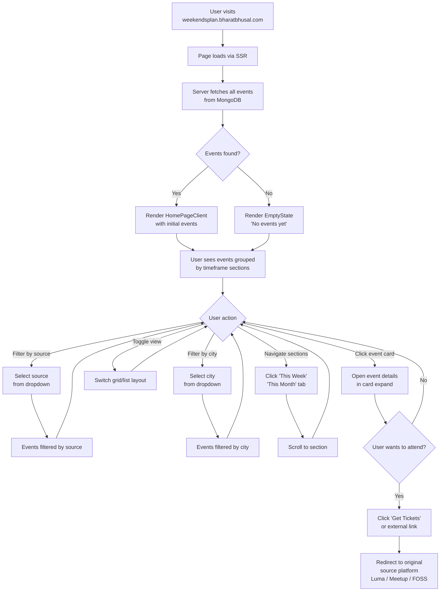
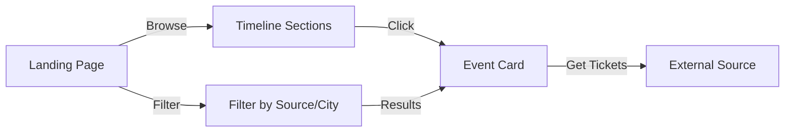
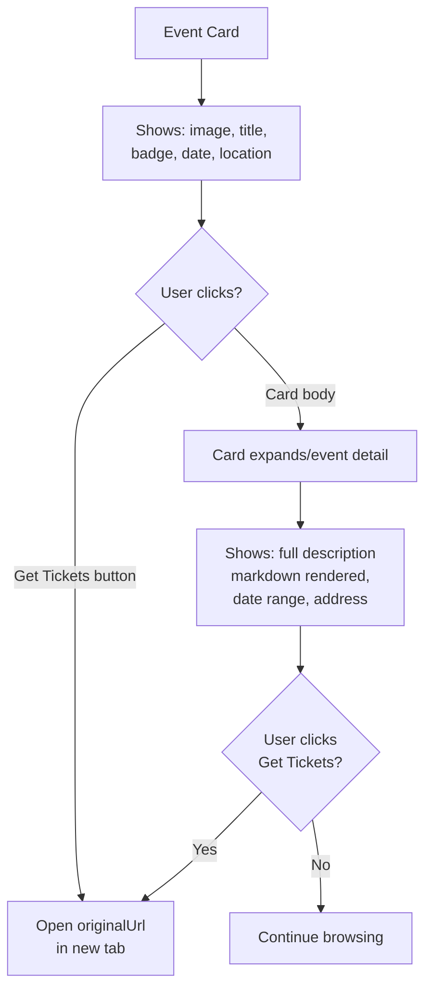

# User Journey

## Overview

Weekends Plan is a public read-only event discovery app. Users browse, filter, and navigate to events. There is no authentication, no user accounts, and no booking flow — all actions redirect to the respective source platform.

## Primary User Flow



## User Flow Diagram (Simplified)



## States

### Landing Page (Events Available)

```
┌──────────────────────────────────────────────────┐
│  ☀ Weekends Plan                  [▼ Source] [▼ City] │
│                                                     │
│                                                     │
│  ● Live (2)                                         │
│  ┌──────────┐ ┌──────────┐                          │
│  │ Event A  │ │ Event B  │                          │
│  │ [Badge]  │ │ [Badge]  │                          │
│  │ Today 5pm│ │ Today 7pm│                          │
│  └──────────┘ └──────────┘                          │
│                                                     │
│  ● This Week (8)                                    │
│  ┌──────────┐ ┌──────────┐ ┌──────────┐            │
│  │ Event C  │ │ Event D  │ │ Event E  │            │
│  └──────────┘ └──────────┘ └──────────┘            │
│                                                     │
│  ● June 2026 (12)                                   │
│  ┌──────────┐ ┌──────────┐                          │
│  │ Event F  │ │ Event G  │                          │
│  └──────────┘ └──────────┘                          │
└──────────────────────────────────────────────────┘
```

### Empty State (No Events)

```
┌──────────────────────────────────────────────────┐
│                                                     │
│                                                     │
│              📅 No events found                     │
│         Try adjusting your filters                  │
│                                                     │
│              [Clear Filters]                        │
│                                                     │
│                                                     │
└──────────────────────────────────────────────────┘
```

### Loading State

```
┌──────────────────────────────────────────────────┐
│  ┌─────────────────────────────────────────────┐  │
│  │ ████████░░░░░░░░░░░░░░░░░░░░                │  │
│  └─────────────────────────────────────────────┘  │
│                                                     │
│  ┌──────────┐  ┌──────────┐  ┌──────────┐         │
│  │ ████████ │  │ ████████ │  │ ████████ │         │
│  │ ██░░░░░░ │  │ ██░░░░░░ │  │ ██░░░░░░ │         │
│  │ ██░░░░░░ │  │ ██░░░░░░ │  │ ██░░░░░░ │         │
│  └──────────┘  └──────────┘  └──────────┘         │
└──────────────────────────────────────────────────┘
```

## Event Card Interaction



## Responsive Behavior

| Breakpoint          | Layout                          |
| ------------------- | ------------------------------- |
| Desktop (>1024px)   | 3-column grid for default cards |
| Tablet (768–1024px) | 2-column grid                   |
| Mobile (<768px)     | 1-column grid                   |
| List view (all)     | 2-column horizontal rows        |

## Error Scenarios

| Scenario                 | Handling                                                               |
| ------------------------ | ---------------------------------------------------------------------- |
| MongoDB unreachable      | `getEvents` catches error, returns empty array → EmptyState shown      |
| Ingestion pipeline fails | GitHub Actions logs error, no data update until next run               |
| Source API down          | Individual source marked as failed in `sourceResults`, others continue |
| ISR revalidation fails   | Events are stale until next successful revalidation or manual trigger  |
